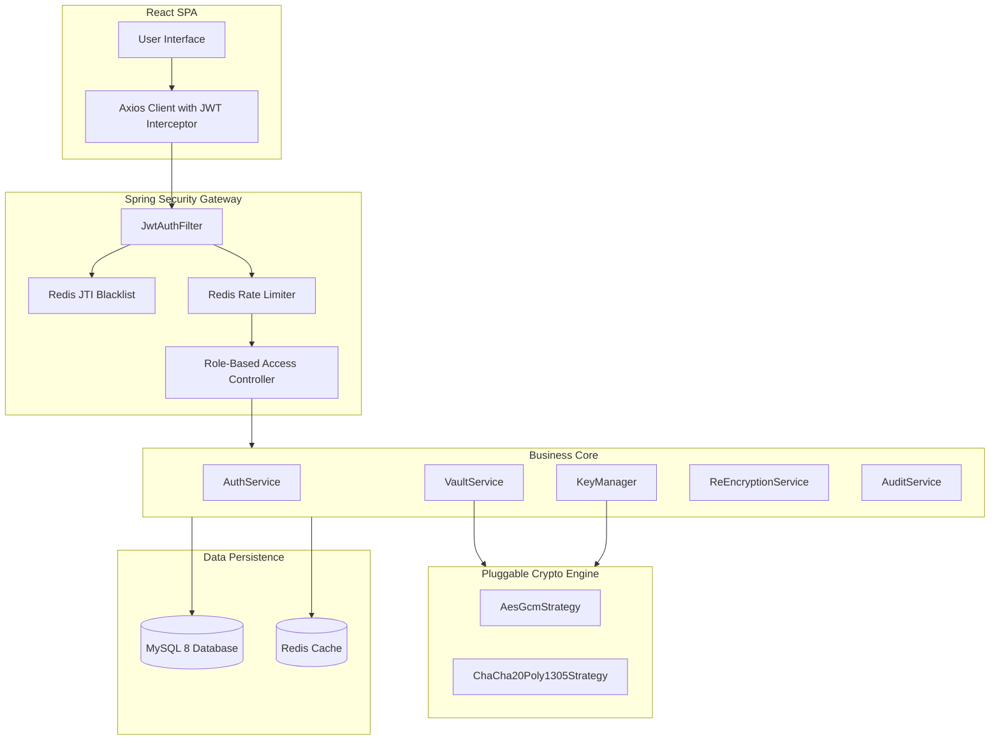
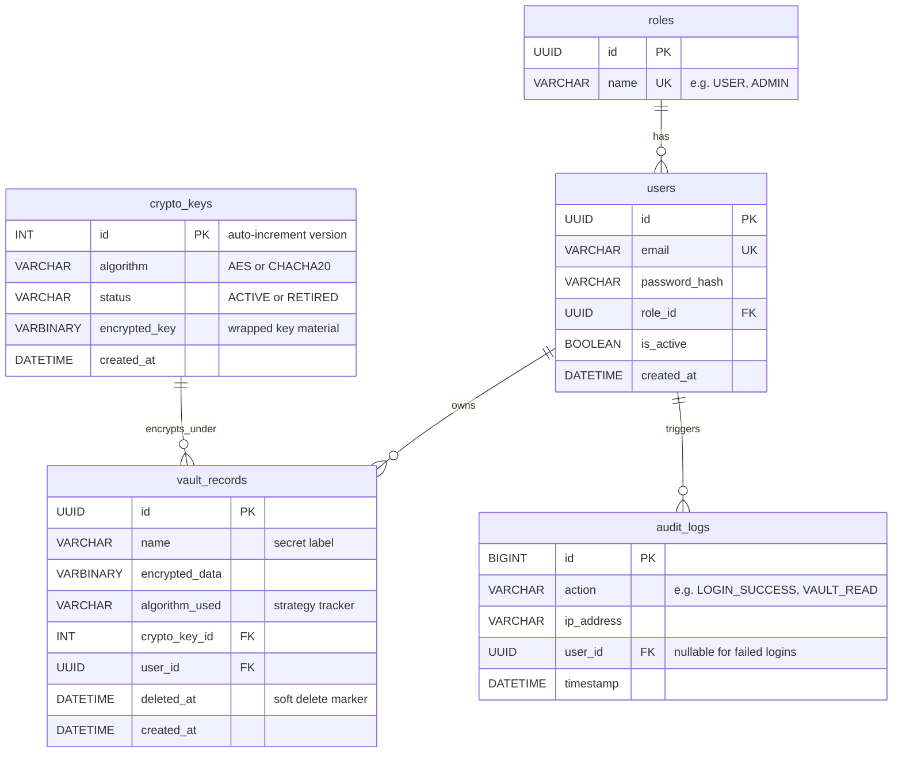

# CryptoVault — Enterprise Cryptographic Vault

### Technologies used: Java 21, Spring Boot 3, Spring Security, Spring Data JPA, Hibernate, Flyway Migrations, MySQL 8, Redis 7, Bouncy Castle Provider, JWT (jjwt), Testcontainers, JUnit 5, Mockito, OpenAPI / Swagger UI, React 19, TypeScript, Vite, Vanilla CSS

---

CryptoVault is a secure, bank-grade, crypto-agile secrets storage engine designed for modern financial architectures. It solves the critical problem of securing sensitive data at rest by implementing pluggable cryptography strategies, envelope encryption (Key Encrypting Keys wrapping Data Keys), automated key rotation, and compliance auditing, all accessed via a modern dark-mode React frontend.

---

## Key Features

- 🛡️ **Crypto-Agility**: Dynamically swap the active encryption algorithm between `AES-256-GCM` and `ChaCha20-Poly1305` from a single config switch — no code changes, and legacy records keep decrypting under whatever algorithm they were written with.
- 🔑 **Envelope Encryption**: Data keys are wrapped (encrypted) using a Master Key (KEK) derived via SHA-256 hashing of a high-entropy secret held in an environment variable. Raw key material is never stored in plaintext in the database.
- 🔄 **Key Rotation & Migration**: Administrators rotate data keys at the click of a button (`POST /api/admin/rotate-key`) and kick off a background re-encryption pass (`POST /api/admin/re-encrypt`) to migrate legacy records onto the active key version and cipher.
- 🔐 **JWT Auth + Hard Logout**: Stateless HMAC-SHA256 access tokens (`userId`, `role`, `jti`, `exp`). Logout blacklists the token's `jti` in Redis for its remaining lifetime, and the `JwtAuthFilter` rejects it on every subsequent request — so "logged out" actually means rejected, not merely forgotten.
- 👮 **Role-Based Access Control**: Method-level security (`@PreAuthorize("hasRole('ADMIN')")`) separates `USER` and `ADMIN` capabilities; admin-only routes return a clean `403` to ordinary users.
- 📊 **Compliance Auditing**: Fully searchable, paginated compliance trails tracking logins, failed auth attempts, registrations, vault reads/writes/deletes, and key rotations — complete with proxy-aware IP capturing and nullable user IDs for failed logins against unknown emails.
- 🚫 **Brute-Force Protection**: Redis-backed rate limiting tracks failed authentication attempts separately by IP and email, locking abusers out for 15 minutes after 5 failures.
- 🧪 **Containerized Testing**: 44 unit tests (JUnit 5 + Mockito) plus `Testcontainers` integration tests that spin up real, isolated MySQL 8 and Redis 7 instances during verification builds.

---

## System Architecture



### Cryptographic Key Hierarchy (Envelope Encryption)
```text
  [ CRYPTOVAULT_MASTER_SECRET ] (Env Variable)
              │
              ▼ (SHA-256 Hashing)
      [ Wrap Master KEK ]
              │
              ├─────── Wrap / Unwrap ───────┐
              ▼                             ▼
      [ Active Data Key v2 ]        [ Retired Data Key v1 ]
              │                             │
              ▼ (Encrypts New Data)         ▼ (Decrypts Legacy Data Only)
       [ Vault Record ]              [ Vault Record ]
```

---

## Database Schema



The schema is owned by **Flyway migrations** (`backend/src/main/resources/db/migration`), and Hibernate runs with `ddl-auto=validate` — it confirms the entities match the schema but never edits it.

| Migration | Purpose |
|---|---|
| `V1__initial_schema.sql` | Five tables + all indexes (InnoDB, utf8mb4) |
| `V2__seed_roles.sql` | Seeds the `USER` and `ADMIN` roles |
| `V3__add_encrypted_key_to_crypto_keys.sql` | Wrapped data-key material column |
| `V4__add_name_to_vault_records.sql` | Human-readable secret label |

---

## Project Structure

```
crypto-vault/
├── backend/
│   ├── docker-compose.yml        # MySQL 8 + Redis 7
│   ├── pom.xml
│   └── src/main/java/com/cryptovault/
│       ├── config/               # SecurityConfig, CryptoConfig, OpenApiConfig
│       ├── controller/           # Auth, Me, Health, Vault, Admin, AdminKey
│       ├── service/              # AuthService, VaultService, KeyManager,
│       │                         #   ReEncryptionService, AuditService
│       ├── crypto/               # CipherStrategy, AesGcm, ChaCha20Poly1305, CryptoEngine
│       ├── security/             # JwtService, JwtAuthFilter, RateLimiter, TokenBlacklist
│       ├── entity/               # Role, User, CryptoKey, VaultRecord, AuditLog
│       ├── repository/           # Spring Data JPA repositories
│       ├── dto/                  # Request/response records
│       └── exception/            # GlobalExceptionHandler + typed exceptions
└── frontend/                     # React 19 + TypeScript + Vite
    └── src/
        ├── pages/                # Landing, Login, Dashboard, Vault, Admin
        └── services/api.ts       # Axios client with JWT interceptor
```

---

## Getting Started

### Prerequisites
- **Java 21** (Temurin recommended)
- **Node.js** (v18+)
- **Docker Desktop**

### 1. Run Databases & Caches
Spin up MySQL 8 and Redis 7 in the background:
```bash
cd backend
docker compose up -d
```

### 2. Start the Backend API
Run the Spring Boot application. On startup, Flyway applies all migrations and the key manager seeds key version 1 if none exists.
```bash
./mvnw spring-boot:run
```
*Verify Health Status:* `curl http://localhost:8081/api/health` should return `{"status":"UP","service":"cryptovault"}`.

### 3. Start the React Frontend
Navigate to the `frontend` directory, install packages, and spin up Vite:
```bash
cd ../frontend
npm install                   # Installs react, react-dom, axios, etc.
npm run dev                   # Starts dev server on http://localhost:5173
```
Open [http://localhost:5173](http://localhost:5173) in your browser.

---

## Configuration

Sensible dev defaults let the app boot out of the box. **Override these via environment variables before deploying anywhere real** (see `backend/src/main/resources/application.yml`):

| Setting | Env Variable | Default | Notes |
|---|---|---|---|
| Master encryption secret | `CRYPTOVAULT_MASTER_SECRET` | `dev-master-secret-...` | Wraps all data keys. Rotate-proof; keep out of source control. |
| JWT signing secret | `CRYPTOVAULT_JWT_SECRET` | `dev-only-change-me-...` | HMAC-SHA256, must be ≥ 32 bytes. |
| Active cipher | `cryptovault.crypto.active-algorithm` | `AES-256-GCM` | The crypto-agility switch. Set to `CHACHA20-POLY1305` to change new encryptions. |
| Token lifetime | `cryptovault.jwt.expiration-minutes` | `60` | Single access token, no refresh tokens in the MVP. |

---

## API Reference

| Method | Endpoint | Auth | Description |
|---|---|---|---|
| `GET` | `/api/health` | public | Liveness check |
| `POST` | `/api/auth/register` | public | Create user, bcrypt-hash password, issue JWT |
| `POST` | `/api/auth/login` | public | Verify credentials, issue JWT (generic 401 on failure) |
| `POST` | `/api/auth/logout` | user | Blacklist the current JWT's `jti` in Redis |
| `GET` | `/api/me` | user | Current principal — proves the filter + blacklist end-to-end |
| `POST` | `/api/vault/store` | user | Encrypt + store a record under the active algorithm/key |
| `GET` | `/api/vault` | user | List the caller's record metadata |
| `GET` | `/api/vault/{id}` | owner | Retrieve + decrypt by the record's stored algorithm/key version |
| `DELETE` | `/api/vault/{id}` | owner | Soft-delete a record (audit integrity) |
| `GET` | `/api/admin/audit` | admin | Paginated, filterable audit log (`userId`, `action`, `page`, `size`) |
| `POST` | `/api/admin/rotate-key` | admin | Generate a new active key version; retire the previous |
| `POST` | `/api/admin/re-encrypt` | admin | Migrate legacy records onto the active key/cipher |
| `GET` | `/api/admin/ping` | admin | Admin-only liveness probe (exercises RBAC) |

---

## API Testing with Swagger UI

Access the interactive documentation:
*   **Swagger HTML Interface**: [http://localhost:8081/swagger-ui.html](http://localhost:8081/swagger-ui.html)
*   **OpenAPI Specs**: [http://localhost:8081/v3/api-docs](http://localhost:8081/v3/api-docs)

To test secure endpoints:
1. Register/Login using `/api/auth/login` to obtain a JWT.
2. Click the **Authorize** button at the top-right of Swagger.
3. Paste the token and click authorize. All subsequent calls will carry the bearer header.

---

## Test Executions

### Running Unit Tests
Executes the unit and mocking suites (44 tests). Does not require Docker:
```bash
cd backend
./mvnw test -Dtest=*Test
```

### Running Integration Tests
Executes the containerized integration tests (matching `*IT`) using Testcontainers — **requires Docker Desktop to be running**:
```bash
cd backend
./mvnw verify
```

### Building the Frontend
Type-checks and produces a production bundle:
```bash
cd frontend
npm run build
```

---

## Roadmap

The MVP (Phases 0–8) is **complete**: schema, JWT auth with hard logout, RBAC, rate limiting, the pluggable crypto engine, key versioning/rotation, the vault store/retrieve flow, audit logging, and the React UI.

Stretch goals (Phase 9), tackled only once the MVP is solid:
- **V2:** MFA (TOTP / email OTP via Redis) and failed-login alerting. *(Background re-encryption is already implemented.)*
- **V3:** Post-quantum cryptography via Bouncy Castle — ML-KEM, ML-DSA, and hybrid `X25519 + ML-KEM`.
