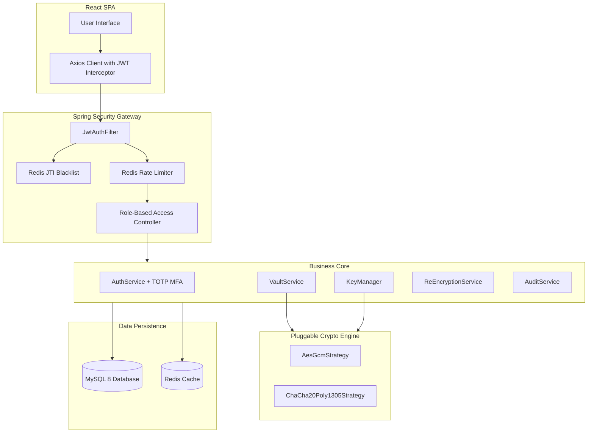
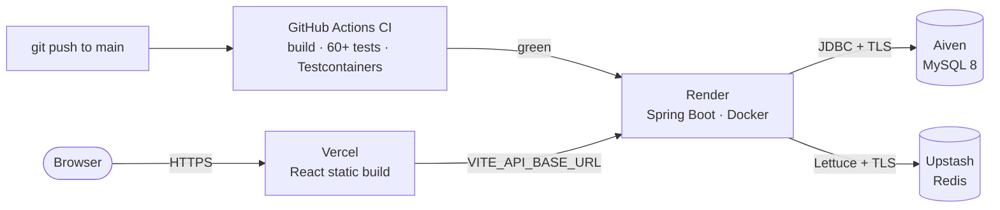
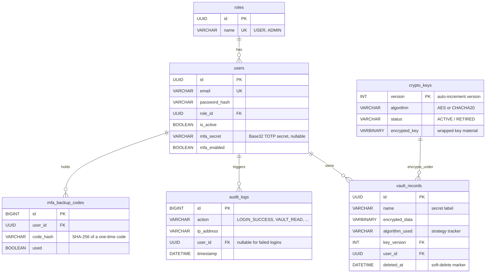

<div align="center">

# 🔐 CryptoVault
### Enterprise Cryptographic Vault

A **crypto-agile** secrets-storage engine — envelope encryption, key rotation, TOTP MFA, and full audit logging, implemented from scratch.

<br/>

[](https://github.com/Jenak26/cryptovault/actions/workflows/ci.yml)

[](#)
[](#)
[](#)
[](#)
[](#)
[](#)
[](#)
[](#)

**[🚀 Live Demo](https://cryptovault-beige-beta.vercel.app)** &nbsp;•&nbsp; **[📖 Security Model](SECURITY.md)** &nbsp;•&nbsp; **[🧭 Design Decisions](docs/adr/README.md)**

</div>

> _The live demo runs on free tiers — the first request after idle can take ~50 s to wake the backend._

---

CryptoVault is a secure, **crypto-agile** secrets-storage engine. It solves the classic problem of protecting sensitive data **at rest** by implementing — from scratch — the patterns a managed KMS/HSM provides: pluggable cryptography, **envelope encryption** (Key-Encrypting-Keys wrapping Data-Keys), HKDF-derived key material, automated **key rotation**, multi-factor authentication, and full **compliance auditing** — all behind a hardened Spring Security gateway and a dark-mode React frontend.

> **🎯 Scope honesty.** This is a *learning-grade* implementation of production patterns, not a drop-in replacement for a real KMS/HSM. The point is to make the mechanics explicit instead of hiding them behind a cloud API. See [`SECURITY.md`](SECURITY.md) for the full threat model and an honest list of simplifications.

---

## 💡 What this project demonstrates

This isn't a CRUD tutorial — it's built to show depth across the stack a fintech/bank backend role cares about:

- **Applied cryptography done correctly** — envelope encryption, AEAD ciphers with per-call random nonces, **HKDF** (not a raw hash) for key derivation, and tamper detection. The reasoning behind each choice is written down as [ADRs](docs/adr/README.md).
- **Security engineering** — stateless JWT with **real** server-side revocation, RBAC, brute-force rate limiting, generic auth errors (no user enumeration), and a hand-rolled **RFC 6238 TOTP** second factor with one-time recovery codes.
- **Production data discipline** — schema owned by **Flyway** migrations (never `ddl-auto=update`), `ddl-auto=validate` to catch drift, versioned keys, and soft-deletes for audit integrity.
- **Testing maturity** — 60+ JUnit 5 / Mockito unit tests **plus Testcontainers integration tests** that boot real MySQL + Redis, all gated by CI on every push.
- **Full-stack + DevOps delivery** — a typed React SPA, a multi-stage Docker build, GitHub Actions CI, and a **live deployment** across four managed services.

---

## ✨ Key Features

- 🛡️ **Crypto-Agility** — swap the active cipher between `AES-256-GCM` and `ChaCha20-Poly1305` from a single config switch. No code changes, and legacy records keep decrypting under whatever algorithm they were written with.
- 🔑 **Envelope Encryption** — data keys are wrapped under a Master Key (KEK) derived via **HKDF-SHA256** from a high-entropy secret in an environment variable. Raw key material never touches the database in plaintext.
- 🔄 **Key Rotation & Migration** — rotate the active data key at the click of a button (`POST /api/admin/rotate-key`) and run a background re-encryption pass (`POST /api/admin/re-encrypt`) to migrate old records onto the new key/cipher.
- 🔐 **JWT Auth + Hard Logout** — stateless HMAC-SHA256 tokens (`userId`, `role`, `jti`, `exp`); logout blacklists the token's `jti` in Redis for its remaining lifetime, and the filter rejects it on every request. "Logged out" actually means rejected.
- 🔒 **TOTP Multi-Factor Auth** — optional per-user 2FA built **from scratch** to RFC 6238 (no library). Login becomes two-step, and enrolment issues **one-time recovery codes** (stored hashed) so a lost device can't lock you out. Works with Google Authenticator, Authy, 1Password.
- 👮 **Role-Based Access Control** — method-level security (`@PreAuthorize("hasRole('ADMIN')")`) separates `USER` and `ADMIN`; admin routes return a clean `403` to ordinary users.
- 📊 **Compliance Auditing** — paginated, filterable trails of logins, failed attempts, registrations, vault reads/writes/deletes, and key rotations — with proxy-aware IP capture and nullable user IDs for failed logins on unknown emails.
- 🚫 **Brute-Force Protection** — Redis-backed rate limiting tracks failures separately by IP **and** email, locking out for 15 minutes after 5 failures.
- 🧪 **Containerized Testing** — JUnit 5 + Mockito unit suites plus `Testcontainers` integration tests that spin up real, isolated MySQL 8 + Redis 7 during the verification build.

---

## 🧰 Tech Stack

| Layer | Technologies |
|---|---|
| **Language & runtime** | Java 21 (Temurin), Node.js 20 |
| **Backend framework** | Spring Boot 3.5 · Spring Web (REST) · Spring Security · Spring Data JPA / Hibernate · Spring Data Redis |
| **Cryptography** | HKDF-SHA256 (key derivation) · AES-256-GCM · ChaCha20-Poly1305 (Bouncy Castle) · BCrypt (passwords) · RFC 6238 TOTP + Base32 (hand-rolled) |
| **Auth & security** | JWT via `jjwt` (HS256) · Redis JWT `jti` blacklist · Redis rate limiter · method-level RBAC |
| **Persistence** | MySQL 8 (InnoDB, utf8mb4) · Flyway migrations · Redis 7 |
| **API & docs** | OpenAPI 3 / Swagger UI (springdoc) |
| **Testing** | JUnit 5 · Mockito · AssertJ · Testcontainers (real MySQL + Redis) |
| **Build tooling** | Maven (wrapper) · Docker (multi-stage) · Vite · npm · oxlint |
| **Frontend** | React 19 · TypeScript · Vite · Axios · vanilla CSS |
| **CI/CD & hosting** | GitHub Actions · Render (backend) · Aiven (MySQL) · Upstash (Redis) · Vercel (frontend) |

---

## 🏛️ System Architecture



### Cryptographic Key Hierarchy (Envelope Encryption)
```text
  [ CRYPTOVAULT_MASTER_SECRET ] (Env Variable / would be a KMS/HSM in prod)
              │
              ▼ (HKDF-SHA256, salt + domain-separation label)
      [ Master KEK ]  — derived in memory, never stored
              │
              ├─────── Wrap / Unwrap (AES-256-GCM) ───────┐
              ▼                                            ▼
      [ Active Data Key v2 ]                      [ Retired Data Key v1 ]
              │                                            │
              ▼ (Encrypts NEW data)                        ▼ (Decrypts LEGACY data only)
       [ Vault Record ]                             [ Vault Record ]
```

---

## ☁️ Deployment & Infrastructure

CryptoVault runs live across four free-tier managed services, deployed straight from this repo. The backend ships as a **multi-stage Docker image**; every connection detail (DB, cache, secrets, CORS, port) is environment-driven, so the same image runs locally and in the cloud unchanged.



| Concern | Service | Notes |
|---|---|---|
| Frontend hosting | **Vercel** | Vite static build; `VITE_API_BASE_URL` points at the backend |
| Backend hosting | **Render** | Runs `backend/Dockerfile`; honours the injected `PORT`; free instance sleeps when idle |
| Relational DB | **Aiven for MySQL 8** | Flyway applies all migrations on first boot |
| Cache / Redis | **Upstash Redis** | JWT blacklist, rate limiter, MFA challenges (TLS) |
| CI | **GitHub Actions** | Builds + runs unit **and** Testcontainers tests against real MySQL/Redis on every push/PR |
| Containerisation | **Docker** | Multi-stage build (Maven → JRE), runs as non-root |

Full, click-by-click setup is in **[`DEPLOYMENT.md`](DEPLOYMENT.md)**.

---

## 🗄️ Database Schema



The schema is **owned by Flyway** (`backend/src/main/resources/db/migration`); Hibernate runs `ddl-auto=validate` to confirm the entities match it but never edits it.

| Migration | Purpose |
|---|---|
| `V1__initial_schema.sql` | Five core tables + all indexes (InnoDB, utf8mb4) |
| `V2__seed_roles.sql` | Seeds the `USER` and `ADMIN` roles |
| `V3__add_encrypted_key_to_crypto_keys.sql` | Wrapped data-key material column |
| `V4__add_name_to_vault_records.sql` | Human-readable secret label |
| `V5__add_mfa_to_users.sql` | TOTP secret + `mfa_enabled` flag |
| `V6__add_mfa_backup_codes.sql` | Hashed one-time recovery codes |

---

## 🗂️ Project Structure

```
crypto-vault/
├── backend/
│   ├── Dockerfile                  # multi-stage build (Maven → JRE), non-root
│   ├── docker-compose.yml          # local MySQL 8 + Redis 7
│   ├── pom.xml
│   └── src/main/java/com/cryptovault/
│       ├── config/                 # SecurityConfig (+ CORS), CryptoConfig, OpenApiConfig
│       ├── controller/             # Auth, Mfa, Me, Health, Vault, Admin, AdminKey
│       ├── service/                # AuthService, VaultService, KeyManager,
│       │                           #   ReEncryptionService, AuditService
│       ├── crypto/                 # CipherStrategy, AesGcm, ChaCha20Poly1305, CryptoEngine
│       ├── security/               # JwtService, JwtAuthFilter, TokenBlacklist, RateLimiter,
│       │                           #   TotpService, MfaChallengeStore, BackupCodes
│       ├── entity/ repository/ dto/ exception/
│       └── resources/db/migration/ # Flyway V1–V6
├── frontend/                       # React 19 + TypeScript + Vite
│   └── src/{pages, components, services}/
├── docs/adr/                       # Architecture Decision Records (the "why")
├── SECURITY.md                     # threat model + simplifications vs production
└── DEPLOYMENT.md                   # live-deploy runbook
```

---

## 🚀 Run It Locally

### Prerequisites
- **Java 21** (Temurin recommended) · **Node.js 18+** · **Docker Desktop**

### 1 — Start MySQL + Redis
```bash
cd backend
docker compose up -d            # MySQL 8 on :3306, Redis 7 on :6379
```

### 2 — Start the backend API
On boot, Flyway runs every migration and `KeyManager` seeds data-key version 1.
```bash
./mvnw spring-boot:run           # http://localhost:8081
```
Health check:
```bash
curl http://localhost:8081/api/health
# {"status":"UP","service":"cryptovault"}
```
> Dev defaults in `application.yml` let it boot with zero config. **Override the secrets before deploying anywhere real** (see [Configuration](#-configuration)).

### 3 — Start the frontend
```bash
cd ../frontend
npm install
npm run dev                      # http://localhost:5173
```

### 4 — Try the full flow
1. **Register** an account, then **log in**.
2. Store a secret in the **Vault**, then view (decrypt) it.
3. On the **Dashboard**, enable **2FA** — scan/enter the secret in an authenticator app, confirm, and **save the recovery codes**. Log out and back in; it now asks for a code.
4. Log out → confirm the old token is rejected.

**Promote yourself to admin** (to see the audit log & key rotation) — registration defaults to `USER`:
```sql
UPDATE users SET role_id = (SELECT id FROM roles WHERE name = 'ADMIN')
WHERE email = 'you@example.com';
```
Log out/in to pick up the new role.

---

## ⚙️ Configuration

Everything is environment-driven. Defaults are for local dev only.

| Setting | Env variable | Default | Notes |
|---|---|---|---|
| Master encryption secret | `CRYPTOVAULT_MASTER_SECRET` | `dev-master-secret-…` | Derives the KEK. **Permanent** — changing it after data exists makes stored keys unrecoverable. |
| JWT signing secret | `CRYPTOVAULT_JWT_SECRET` | `dev-only-change-me-…` | HMAC-SHA256, must be ≥ 32 bytes. |
| Active cipher | `cryptovault.crypto.active-algorithm` | `AES-256-GCM` | Crypto-agility switch; set to `CHACHA20-POLY1305` for new encryptions. |
| Token lifetime | `cryptovault.jwt.expiration-minutes` | `60` | Single access token, no refresh tokens. |
| Allowed CORS origins | `CRYPTOVAULT_CORS_ALLOWED_ORIGINS` | `http://localhost:5173` | Comma-separated; set to the deployed frontend URL in prod. |
| DB / Redis | `SPRING_DATASOURCE_*`, `SPRING_DATA_REDIS_*` | local docker | Standard Spring Boot properties. |

---

## 📚 API Reference

| Method | Endpoint | Auth | Description |
|---|---|---|---|
| `GET` | `/api/health` | public | Liveness check |
| `POST` | `/api/auth/register` | public | Create user, BCrypt-hash password, issue JWT |
| `POST` | `/api/auth/login` | public | Verify credentials; issue a JWT **or** an MFA challenge |
| `POST` | `/api/auth/mfa/verify` | public | Complete MFA login: challenge + TOTP/backup code → JWT |
| `POST` | `/api/auth/logout` | user | Blacklist the current JWT's `jti` in Redis |
| `GET` | `/api/me` | user | Current principal + MFA status |
| `POST` | `/api/mfa/setup` | user | Begin TOTP enrolment (secret + otpauth URI) |
| `POST` | `/api/mfa/enable` | user | Activate MFA; returns one-time backup codes |
| `POST` | `/api/mfa/backup-codes/regenerate` | user | Re-issue backup codes (invalidates the old set) |
| `POST` | `/api/mfa/disable` | user | Disable MFA (requires a valid code) |
| `POST` | `/api/vault/store` | user | Encrypt + store a record under the active algorithm/key |
| `GET` | `/api/vault` | user | List the caller's record metadata |
| `GET` | `/api/vault/{id}` | owner | Retrieve + decrypt by the record's stored algorithm/version |
| `DELETE` | `/api/vault/{id}` | owner | Soft-delete a record |
| `GET` | `/api/admin/audit` | admin | Paginated, filterable audit log |
| `POST` | `/api/admin/rotate-key` | admin | New active key version; retire the previous |
| `POST` | `/api/admin/re-encrypt` | admin | Migrate legacy records onto the active key/cipher |
| `GET` | `/api/admin/ping` | admin | Admin-only probe (exercises RBAC) |

### Interactive docs (Swagger UI)
Run locally and open **[localhost:8081/swagger-ui.html](http://localhost:8081/swagger-ui.html)** (specs at `/v3/api-docs`). Use **Login** to get a JWT, click **Authorize**, paste the token, and every call carries the bearer header.

---

## ✅ Testing

```bash
# Unit + slice tests (no Docker needed)
cd backend && ./mvnw test -Dtest='*Test'

# Full verification incl. Testcontainers integration tests (needs Docker running)
cd backend && ./mvnw verify

# Frontend type-check + production build
cd frontend && npm run build
```

Every push and PR runs the **same `verify`** in GitHub Actions against real MySQL + Redis service containers, plus the frontend build — so green CI means it genuinely works end-to-end, not just "on my machine."

---

## 🧭 Design Decisions & Security

- **[`docs/adr/`](docs/adr/README.md)** — Architecture Decision Records explaining the *why* behind HKDF, crypto-agility, envelope encryption, JWT revocation, from-scratch TOTP, and the Flyway-owned schema.
- **[`SECURITY.md`](SECURITY.md)** — the key hierarchy, a STRIDE-lite threat model, and an explicit list of simplifications vs. a production KMS/HSM.

---

## 🗺️ Roadmap

**Done:** the full MVP (schema, JWT auth + hard logout, RBAC, rate limiting, the pluggable crypto engine, key rotation, vault store/retrieve, audit logging, React UI), **plus** TOTP MFA with backup codes and background re-encryption — all deployed live.

**Next:**
- **V2:** failed-login alerting · admin-driven account recovery
- **V3:** post-quantum cryptography via Bouncy Castle — ML-KEM, ML-DSA, and hybrid `X25519 + ML-KEM`

---

<p align="center"><i>Built to demonstrate applied cryptography, security engineering, and full-stack delivery — end to end.</i></p>
